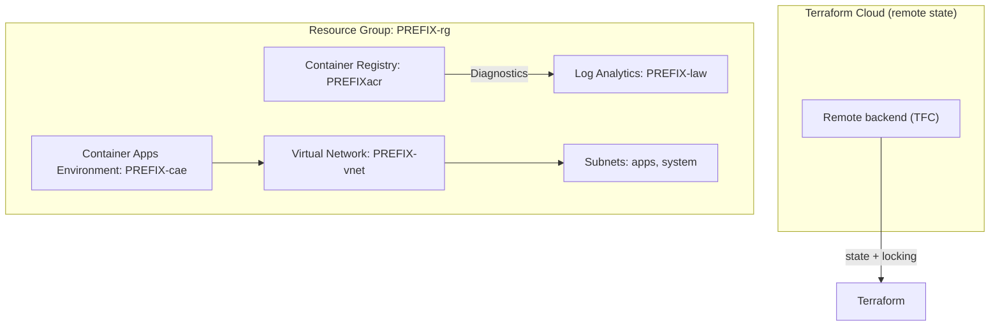

# 🚀 Azure Infra + CI/CD Starter (Terraform + GitHub Actions)
### Push-button Azure infrastructure for junior-to-mid engineers.

This starter packs the Terraform modules, GitHub workflows, and documentation you need to ship a production-ready Azure landing zone with minimal manual setup. It is intentionally boring, modular, and easy to extend.

## ✅ What you get
- Remote-state-ready Terraform baseline (networking, observability, container artifacts, application hosting)
- Clean module boundaries with `.tfvars` driven inputs
- GitHub Actions workflows that call the shared **Terraform Orchestrator** Marketplace Action
- Service Principal based auth today, OIDC ready tomorrow
- GumRoad-friendly docs + diagrams you can hand to customers or teammates

---

## 🧱 Architecture Diagram



---

## 🏁 Quickstart

1. **Bootstrap remote state**  
   Follow [`docs/SETUP_REQUIREMENTS.md`](docs/SETUP_REQUIREMENTS.md) to point Terraform at your Terraform Cloud organization/workspaces (CLI-driven workflow per environment) and copy `terraform/backend.config.example` → `terraform/backend.config`.

2. **Create Azure Service Principal**  
   ```bash
   az ad sp create-for-rbac \
     --name "jteng-gha" \
     --role Contributor \
     --scopes "/subscriptions/<SUB_ID>" \
     --sdk-auth
   ```
   Add these secrets in your repo → *Settings → Secrets and variables → Actions*:
   - `AZURE_CLIENT_ID`
   - `AZURE_CLIENT_SECRET`
   - `AZURE_TENANT_ID`
   - `AZURE_SUBSCRIPTION_ID`
   - `TF_API_TOKEN` (Terraform Cloud user token)

3. **Authenticate locally (optional sanity check)**  
   ```bash
   az login
   az account set --subscription "<YOUR_SUBSCRIPTION_ID>"
   cd terraform
   terraform init -backend-config=backend.config
   terraform workspace new dev || terraform workspace select dev
   terraform plan -var-file=environments/dev.tfvars
   terraform apply -var-file=environments/dev.tfvars -auto-approve
   ```

4. **Run via GitHub Actions**  
   - `terraform-plan.yml` – plan only  
   - `terraform-plan-apply.yml` – plan or plan+apply (workflow input)  
   - `terraform-destroy.yml` – destroys a chosen workspace  
   Trigger them with **Run workflow** → select `environment` + `command`.

---

## ⚙️ Workflow Inputs (workflow_dispatch)
| Input | Values | Description |
| --- | --- | --- |
| `environment` | `dev`, `prod` (extend as needed) | Sets Terraform workspace + tfvars file |
| `command` | `plan`, `plan-apply` | `plan-apply` runs plan → apply; `plan` only outputs |

Destroy workflow only asks for `environment` and always runs `terraform destroy`.

---

## 🧩 Terraform Modules
| Module | Path | Purpose |
| --- | --- | --- |
| Networking | `terraform/modules/network` | VNet + subnets |
| Observability | `terraform/modules/observability` | Log Analytics workspace |
| Container artifacts | `terraform/modules/container_artifacts` | Azure Container Registry + diagnostics + Container Apps Environment |

All inputs are wired through `terraform/environments/*.tfvars` so you stay DRY across workspaces.

---

## ☁️ Remote Backend Expectations
- `terraform/backend.config` stores the Terraform Cloud organization and workspace mapping.  
- GitHub Actions pass this file to the orchestrator so every runner shares the same remote state.  
- Add a GitHub secret named `TF_API_TOKEN` containing a Terraform Cloud user token; workflows set it as `TF_API_TOKEN` for terraform init.  
- The workflows also export `ARM_CLIENT_ID/SECRET/TENANT_ID/SUBSCRIPTION_ID` from your GitHub secrets so the Azure provider can authenticate with your Service Principal.

Until you create the backend file, workflows fall back to local state (useful for quick experiments, but remote is required for production so destroy works anywhere).

---

## 🔐 Auth Today, OIDC Tomorrow
- V1 uses Service Principal secrets for simplicity.  
- Future release will add Federated Credentials (OIDC) so secrets disappear. The orchestrator/action layout already supports that swap.

---

## 💰 Cost Snapshot
| Resource | Cost Notes |
| --- | --- |
| ACR Basic | ~\$0.17/day when idle |
| Container Apps Environment | Minimal while empty |
| Log Analytics | Charged on ingestion/retention |

Destroy dev workspaces when idle to keep spend near-zero.

---

## 🗺️ Roadmap
- Key Vault module  
- Private Endpoints + Private DNS  
- AWS/GCP starter kits (reuse orchestrator)  
- Federated credentials (OIDC)  
- Sample microservice deployment into CAE  
- Optional add-on modules sold via GumRoad

---

## 📄 License
MIT

## 💬 Support
support@jtengineering.dev
