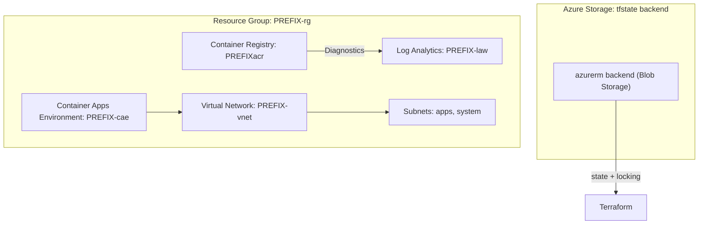

# 🚀 Azure Infra + CI/CD Starter (Terraform + GitHub Actions)
### Push-button Azure infrastructure for junior-to-mid engineers.

This starter packs the Terraform modules, GitHub workflows, and documentation you need to ship a production-ready Azure landing zone with minimal manual setup. It is intentionally boring, modular, and easy to extend.

## ✅ What you get
- Remote-state-ready Terraform baseline (networking, observability, container artifacts, application hosting)
- Clean module boundaries with `.tfvars` driven inputs
- GitHub Actions workflows that call the shared **Terraform Orchestrator** Marketplace Action
- Service Principal based auth today, OIDC ready tomorrow
- GumRoad-friendly docs + diagrams you can hand to customers or teammates

---

## 🧱 Architecture Diagram



---

## 🏁 Quickstart

1. **Bootstrap remote state**  
   Follow [`docs/SETUP_REQUIREMENTS.md`](docs/SETUP_REQUIREMENTS.md) to provision the Azure Storage backend (resource group + storage account + container) and copy `terraform/backend.config.example` → `terraform/backend.config`.

2. **Create Azure Service Principal**  
   ```bash
   az ad sp create-for-rbac \
     --name "jteng-gha" \
     --role Contributor \
     --scopes "/subscriptions/<SUB_ID>" \
     --sdk-auth
   ```
   Add these secrets in your repo → *Settings → Secrets and variables → Actions*:
   - `AZURE_CLIENT_ID`
   - `AZURE_CLIENT_SECRET`
   - `AZURE_TENANT_ID`
   - `AZURE_SUBSCRIPTION_ID`

3. **Authenticate locally (optional sanity check)**  
   ```bash
   az login
   az account set --subscription "<YOUR_SUBSCRIPTION_ID>"
   cd terraform
   terraform init -backend-config=backend.config
   terraform workspace new dev || terraform workspace select dev
   terraform plan -var-file=environments/dev.tfvars
   terraform apply -var-file=environments/dev.tfvars -auto-approve
   ```

4. **Run via GitHub Actions**  
   - `terraform-plan.yml` – plan only  
   - `terraform-plan-apply.yml` – plan or plan+apply (workflow input)  
   - `terraform-destroy.yml` – destroys a chosen workspace  
   Trigger them with **Run workflow** → select `environment` + `command`.

---

## ⚙️ Workflow Inputs (workflow_dispatch)
| Input | Values | Description |
| --- | --- | --- |
| `environment` | `dev`, `prod` (extend as needed) | Sets Terraform workspace + tfvars file |
| `command` | `plan`, `plan-apply` | `plan-apply` runs plan → apply; `plan` only outputs |

Destroy workflow only asks for `environment` and always runs `terraform destroy`.

---

## 🧩 Terraform Modules
| Module | Path | Purpose |
| --- | --- | --- |
| Networking | `terraform/modules/network` | VNet + subnets |
| Observability | `terraform/modules/observability` | Log Analytics workspace |
| Container artifacts | `terraform/modules/container_artifacts` | Azure Container Registry + diagnostics + Container Apps Environment |

All inputs are wired through `terraform/environments/*.tfvars` so you stay DRY across workspaces.

---

## ☁️ Backend Setup (Azure Storage)
- Terraform keeps its state in a Storage Account so every GitHub job sees the same resources and `destroy` works reliably.
- Run the one-time bootstrap below (or copy it from [`docs/SETUP_REQUIREMENTS.md`](docs/SETUP_REQUIREMENTS.md)), then copy `terraform/backend.config.example` to `terraform/backend.config` and update the names. Terraform automatically creates separate blobs per workspace (e.g., `env:dev/azure-infra-cicd-starter.tfstate`), so you only need one config file.

```bash
TFSTATE_LOCATION="eastus"
TFSTATE_RG="jteng-tfstate-rg"
TFSTATE_SA="jtengtfstate01"
TFSTATE_CONTAINER="tfstate"
SP_OBJECT_ID="<service-principal-object-id>"
SUBSCRIPTION_ID="<YOUR_SUBSCRIPTION_ID>"

az group create --name "$TFSTATE_RG" --location "$TFSTATE_LOCATION"

az storage account create \
  --name "$TFSTATE_SA" \
  --resource-group "$TFSTATE_RG" \
  --location "$TFSTATE_LOCATION" \
  --sku Standard_LRS \
  --kind StorageV2 \
  --allow-blob-public-access false

az storage container create \
  --name "$TFSTATE_CONTAINER" \
  --account-name "$TFSTATE_SA"

az role assignment create \
  --role "Storage Blob Data Contributor" \
  --assignee-object-id "$SP_OBJECT_ID" \
  --assignee-principal-type ServicePrincipal \
  --scope "/subscriptions/$SUBSCRIPTION_ID/resourceGroups/$TFSTATE_RG/providers/Microsoft.Storage/storageAccounts/$TFSTATE_SA"
```

The workflows reuse the same Azure login from `azure/login@v2`, so no extra secrets or SAS tokens are necessary. If `backend.config` is missing, Terraform falls back to local state (fine for experimentation, but remote is required for production).

## ⚙️ What the workflows do
- Each workflow checks out the repo, logs in to Azure with your Service Principal, and runs Terraform **on the GitHub runner** using `terraform/environments/<env>.tfvars`.
- State is stored in the Storage Account you bootstrapped above (`azure-infra-cicd-starter-<workspace>.tfstate` keys). Plan, apply, and destroy all share that state so resource changes stay consistent.
- To change infrastructure, edit the tfvars file (e.g., switch the prefix, location, SKUs), commit, and rerun the workflow for that environment. Terraform handles the diff automatically.

---

## 🔐 Auth Today, OIDC Tomorrow
- V1 uses Service Principal secrets for simplicity.  
- Future release will add Federated Credentials (OIDC) so secrets disappear. The orchestrator/action layout already supports that swap.

---

## 💰 Cost Snapshot
| Resource | Cost Notes |
| --- | --- |
| ACR Basic | ~\$0.17/day when idle |
| Container Apps Environment | Minimal while empty |
| Log Analytics | Charged on ingestion/retention |

Destroy dev workspaces when idle to keep spend near-zero.

---

## 🗺️ Roadmap
- Key Vault module  
- Private Endpoints + Private DNS  
- AWS/GCP starter kits (reuse orchestrator)  
- Federated credentials (OIDC)  
- Sample microservice deployment into CAE  
- Optional add-on modules sold via GumRoad

---

## 📄 License
MIT

## 💬 Support
support@jtengineering.dev
