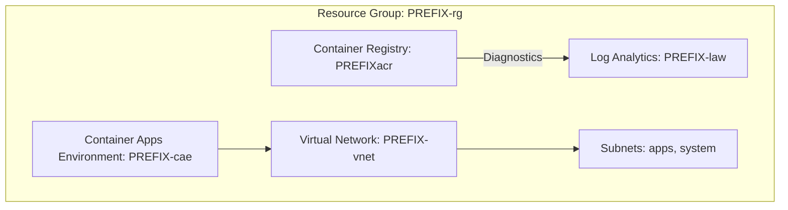

# 🚀 Azure Infra + CI/CD Starter (Terraform + GitHub Actions)
### A lightweight, production-grade Azure foundation for teams starting fresh.

This project gives you a clean, opinionated, repeatable Azure infrastructure starter built with Terraform, integrated with GitHub Actions, and optimized for low cost + fast iteration.

It includes:
- Modular Terraform structure
- Azure Resource Group + VNet + Subnets
- Azure Container Registry (ACR)
- Container Apps Environment (CAE)
- Log Analytics Workspace (LAW)
- Diagnostic settings (ACR → LAW)
- GitHub Actions for plan/apply/destroy

---

## 🧱 Architecture Diagram (Mermaid)



---

## 🏃‍♂️ Quickstart

### 1. Authenticate to Azure
```bash
az login
az account set --subscription "<YOUR_SUBSCRIPTION_ID>"
```

### 2. Deploy Dev Environment
```bash
cd terraform
terraform init
terraform workspace new dev || terraform workspace select dev
terraform plan -var-file=environments/dev.tfvars
terraform apply -var-file=environments/dev.tfvars -auto-approve
```

### 3. Destroy
```bash
terraform destroy -var-file=environments/dev.tfvars -auto-approve
```

---

## 🔐 GitHub Actions Setup

### 1. Create Service Principal
```bash
az ad sp create-for-rbac   --name "jteng-gha"   --role Contributor   --scopes "/subscriptions/<SUB_ID>"   --sdk-auth
```

Add to GitHub Secrets:
- AZURE_CLIENT_ID
- AZURE_CLIENT_SECRET
- AZURE_TENANT_ID
- AZURE_SUBSCRIPTION_ID

### 2. Workflows included
- terraform-plan-apply.yml
- terraform-destroy.yml

---

## 💰 Cost Considerations
| Resource | Cost |
|---------|------|
| ACR Basic | ~$0.17/day |
| CAE | Minimal if unused |
| Log Analytics | Minimal until ingestion |

---

## 🧩 Roadmap
- Key Vault module  
- Private Endpoints  
- AWS/GCP equivalents  
- OIDC auth option  
- Microservice deployment sample  

---

## 📄 License
MIT

## 💬 Support
support@jtengineering.dev
